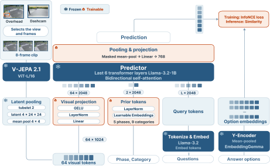
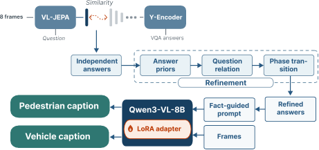

# Traffic-JEPA

Reference implementation of **Traffic-JEPA: Frozen Video World Models for Traffic-Safety VQA**
— 1st place, [AI City Challenge 2026](https://www.aicitychallenge.org/) Track 2 (team **Latent
Painter – UTE**, S2 score **60.0853**, VQA accuracy **87.09%**).

Given a traffic-safety video and a multiple-choice question about a pedestrian or vehicle, the
task is to *pick the correct answer*. Instead of a supervised video-language model, this repo
reads the answer straight out of a **frozen V-JEPA 2.1 world model**: the encoder's latents are
cached once, a lightweight bidirectional predictor turns them into an answer embedding, and the
option is chosen by cosine retrieval against a frozen text encoder. Only a 5.83M-parameter head
is trained — roughly 45 minutes on one RTX 5060 Ti. A sim-derived **graph/temporal decoder**
then reconciles each video's per-phase answers into one logically consistent trajectory, and
those refined answers guide a Qwen3-VL-8B captioner to produce the pedestrian/vehicle
descriptions that complete the Track-2 submission.

## Dataset

All training and evaluation use the **WTS** (Woven Traffic Safety) pedestrian-centric traffic
video dataset — [woven-visionai/wts-dataset](https://github.com/woven-visionai/wts-dataset),
[paper](https://doi.org/10.1007/978-3-031-73116-7_1) — paired overhead (CCTV) and vehicle
(dashcam) views with fine-grained pedestrian/vehicle annotations. Training pairs the synthetic
**SynWTS** questions onto the matching **real** WTS videos; the public-test split ships its own
videos, questions, and bounding boxes.

Arrange the downloaded data under `data/` (or point `TJ_DATA` elsewhere). The directory names
below are how the preprocessing scripts identify each source and split:

```text
data/
├── synwts/data/                     # SynWTS: synthetic questions + boxes
│   ├── annotations/                 # vqa/ caption/ bbox_annotated/
│   └── videos/                      # train/ val/ (SynWTS mp4)
├── woven-traffic/internal/          # real WTS: video/{train,val}/  caption/{train,val}/
└── raw/
    ├── public_test_videos/          # public-test mp4
    └── public_test_annotations/     # public-test boxes: bbox_generated/ + bbox_annotated/
```

The pipeline uses only the WTS dataset's own answer options — no external option augmentation —
so every input has code in this repo that produces it and the run is fully self-contained.

The public-test boxes ship as `WTS_DATASET_PUBLIC_TEST_BBOX.zip`; extract its `annotations/`
directory (the one holding `bbox_generated/` and `bbox_annotated/`) into
`data/raw/public_test_annotations/`. Inference reads them to pick the camera and the time
window for each question — a run without them falls back to the first listed camera and the
full event phase.

## Method

The full Track-2 system has two stages: a frozen-world-model **VQA** stage that this repository
implements, and a **caption-generation** stage that turns the answered facts into the pedestrian
and vehicle descriptions scored by BLEU/METEOR/ROUGE/CIDEr.

### Stage 1 — Answer prediction

<p align="center"></p>

> The selected camera video is encoded by a frozen V-JEPA 2.1. The video representation is
> combined with the question and mapped into the answer embedding space. Cosine scores provide
> the InfoNCE objective during training and the candidate scores for structured decoding during
> inference. Only the modules shown in orange are optimized on SynWTS.

Two heavy encoders run offline: V-JEPA 2.1 caches the visual latents and EmbeddingGemma caches
the answer-option vectors. Training then only moves the predictor — the frozen backbone means a
full run touches no encoder weights, the dataloader reads cached latents off disk, and gradients
flow only into the 5.83M-parameter head.

### Stage 2 — Refinement and caption generation

<p align="center"></p>

> The independent VQA answers pass through the training-free refinement (answer prior, question
> relation, and phase transition), and the refined answers become facts that, together with the
> frames, guide Qwen3-VL-8B to write the pedestrian and vehicle captions.

The per-phase model scores are graph-decoded — a sim-derived answer prior, a question-relation
term, and a temporal Viterbi pass over the event phases — into one logically consistent set of
answers. Those refined answers are fed as facts, with the frames, to a LoRA-adapted Qwen3-VL-8B
that writes the final pedestrian and vehicle captions.

> [!NOTE]
> This repository ships Stage 1 (VQA) and the training-free refinement in full — that is what
> `verify` / `all` reproduce, and it is the source of the leaderboard's **Acc. 87.09** column.
> The Stage-2 Qwen3-VL-8B caption generator is a separate component.

## Documentation

Deeper design notes live under [docs/](docs/):

- [docs/DECODER.md](docs/DECODER.md) — the graph/temporal decoder in full: the four
  log-probability terms (emission, answer prior, question relation, phase transition), the
  add-alpha (Lidstone) smoothing, and the measurements showing the frozen model — not the
  decoder — carries the result.

## Official Leaderboard

AI City Challenge 2026, Track 2 — the official ranking is by the combined **S2** score:

| Rank | Team | S2 ↑ | BLEU-4 ↑ | METEOR ↑ | ROUGE-L ↑ | CIDEr ↑ | Acc. (%) ↑ |
|---:|---|---:|---:|---:|---:|---:|---:|
| **1** | **Latent Painter – UTE (Ours)** | **60.0853** | **0.2798** | **0.4624** | **0.4969** | **0.8396** | **87.0918** |
| 2 | UIT-Kitchen | 57.3307 | 0.2658 | 0.4276 | 0.4595 | 0.5833 | 84.3812 |
| 3 | KZ6 | 56.7949 | 0.2540 | 0.4241 | 0.4471 | 0.7691 | 83.5370 |
| 4 | MobilityAI | 55.5901 | 0.2532 | 0.4233 | 0.4466 | 0.7601 | 81.2042 |
| 5 | Snow leopard | 55.5768 | 0.2438 | 0.4247 | 0.4446 | 0.7243 | 81.5152 |

## Start Here

> [!IMPORTANT]
> **Use the shipped checkpoint:**
>
> **[Install](#install) → [Verify](#a-verify-the-shipped-checkpoint)**
>
> **Train your own model:**
>
> **[Install](#install) → [Data layout](#dataset) → [Run from raw data](#b-run-from-raw-data)**

## Install

Docker — code and checkpoint are baked into the image; mount the data at runtime:

```bash
docker build -t traffic-jepa .

# verify the shipped checkpoint (default command):
docker run --gpus all -e HF_TOKEN=hf_xxx \
  -v $PWD/data:/workspace/Traffic-JEPA/data traffic-jepa verify

# full retrain from raw data:
docker run --gpus all -e HF_TOKEN=hf_xxx \
  -v $PWD/data:/workspace/Traffic-JEPA/data traffic-jepa all
```

Or bare metal:

```bash
pip install --extra-index-url https://download.pytorch.org/whl/cu130 -r requirements.txt
```

| | |
|---|---|
| GPU | 1× NVIDIA, ≥ 12 GB (built/tested on RTX 5060 Ti 16 GB) |
| Driver / CUDA | CUDA 13.0 runtime (matches `torch==2.12.0+cu130`) |
| Disk | ~40 GB free (raw clips + 16 GB encoder cache) |
| Time | verify ≈ 30–40 min · full A→Z ≈ 3 h |
| `HF_TOKEN` | Hugging Face token with access to gated `meta-llama/Llama-3.2-1B` — required |

`V-JEPA 2` (`facebookresearch/vjepa2` via `torch.hub`) and `google/embeddinggemma-300m` download
automatically on first run.

## Run

Every step sources `scripts/env.sh` for its paths. Override the data location without moving
files:

```bash
export TJ_DATA=/mnt/wts
export TEST_VIDEOS=/mnt/wts/raw/public_test_videos
export TEST_BBOX=/mnt/wts/raw/public_test_annotations
```

### (A) Verify the shipped checkpoint

Fast, no training. The decoder's sim tables (`checkpoints/index_sim.jsonl`) are shipped, so this
needs only the public-test videos under `data/` and an `HF_TOKEN`:

```bash
export HF_TOKEN=hf_xxx
bash scripts/00_verify_checkpoint.sh
# -> submissions/verify_final.json, compared against
#    checkpoints/reference_submission.json (100% match)
```

### (B) Run from raw data

One command runs the whole pipeline, or run the numbered steps individually:

```bash
export HF_TOKEN=hf_xxx
bash scripts/run_all.sh                # 01 -> 05, raw data to submission   (~3 h)

# or step by step:
bash scripts/01_manifest_sim.sh        # cut clips + sim manifests           (~30 min, CPU)
bash scripts/02_manifest_real.sh       # cut real clips + real manifests     (~20 min, CPU)
bash scripts/03_preprocess.sh          # V-JEPA latents + Gemma vecs -> cache (~1 h, GPU)
bash scripts/04_train.sh               # train Traffic-JEPA (seed 31)        (~45 min, GPU)
bash scripts/05_submit_test.sh         # public-test inference + postprocess (~30 min, GPU)
```

Outputs: `data/processed/cache_vljepa16_8f/` (cache), `runs/traffic_jepa_world_model/`
(checkpoint), `submissions/submission_final.json`.

Training is seed-deterministic on a fixed GPU; `04_train.sh` yields the shipped weights (same
md5), so the full run lands on the same submission. On a different GPU, bf16 makes the weights
differ slightly (real-val still ~0.813); pass `--deterministic` to `scripts/04_train.sh` to pin
a run.

### Evaluate on real-val (optional)

`scripts/eval_val.sh` re-scores the checkpoint on the labeled real-val split and graph-decodes
it, printing per-category accuracy. The submission does not depend on it.

## Results

| Stage | Result |
|---|---|
| Sim + real manifests | 7652 + 4081 QA |
| Encoder cache | 3414 latents, index 11733 |
| Train (seed 31) | real-val 0.8119 (frozen model alone) |
| Graph decode (real-val) | 0.8861 |
| Public-test submission | matches `checkpoints/reference_submission.json` (verify: 4501/4501) |

The team's official Track-2 entry scored **VQA acc 87.0918 / S2 60.0853** (see leaderboard above).
That submission used an extra offline option-augmentation step whose generator is not part of this
release; the shipped pipeline drops it so every input is produced by code here and the run is fully
self-contained. On labelled real-val the two are within 0.03 pp after decoding (0.8864 → 0.8861),
and the two public-test submissions agree on 4488/4501 answers (99.71 %).

## Project Layout

```text
traffic_jepa/                 # the pipeline package
├── data/          # cached-latent dataset + collator; manifest builders; preprocess
│   ├── build_manifest.py        # cut SynWTS clips -> sim manifest
│   ├── build_real_manifest.py   # pair sim QA onto real WTS videos
│   ├── preprocess.py            # V-JEPA latents + Gemma vectors -> cache
│   └── wts_cached.py            # cached-latent Dataset + collator
├── modeling/      # frozen V-JEPA latent -> bidirectional LM predictor -> cosine
│   ├── traffic_jepa_model.py    # the model: visual proj, predictor, cosine scoring
│   ├── predictor.py             # Llama-3.2-1B, last 6 layers, causal mask removed
│   ├── labels.py                # phase + question-selector vocabularies
│   ├── tokenizer.py             # question tokenization
│   └── hf_auth.py               # gated-checkpoint login
├── training/      # InfoNCE training loop
│   └── train.py
├── inference/     # end-to-end public-test submission
│   ├── predict.py               # camera/window selection + model scoring backend
│   └── submit.py                # inference -> scores -> decode -> submission
├── postprocess/   # graph/temporal score decoder
│   ├── graph_decode.py          # real-val decoder (prior + relation + temporal)
│   └── decode_test.py           # public-test decoder
└── evaluation/    # re-evaluation + submission comparison
    ├── reeval.py
    └── compare_submissions.py

scripts/           # env.sh + 00..05 ordered steps, run_all.sh (+ eval_val.sh, optional)
configs/           # train_args.json, route.json, WTS_VQA_PUBLIC_TEST.json
checkpoints/       # model_best.pt + run_args.json + reference_submission.json + index_{sim,real}.jsonl
docs/              # DECODER.md
Dockerfile         # code + checkpoint baked in
entrypoint.sh      # docker dispatch: `verify` (default) or `all`
```

## Troubleshooting

- `scripts/05_submit_test.sh` exits with `FATAL: 0 videos found…` if the public-test videos are
  missing — it never emits a silent all-fallback submission. Fix `TEST_VIDEOS` / `TEST_BBOX`.
- `scripts/env.sh` exits if `HF_TOKEN` is unset.
- `build_manifest.py` skips and re-cuts any partial clip left by an interrupted run (it reuses
  only clips ≥ 1 KB).

## License

This project is released under the [MIT License](LICENSE).
