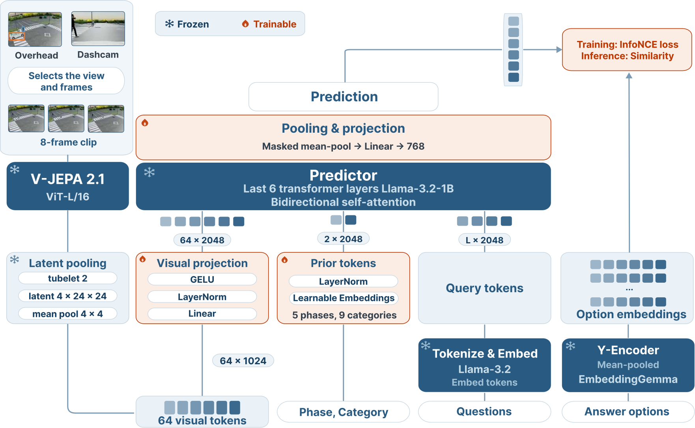
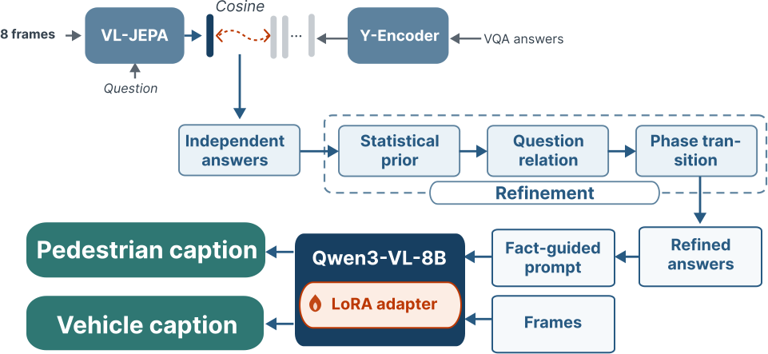

# 2026AICITY_Track2_LatentPainterUTE

🥇 1st Place Solution to the 10th AI City Challenge (2026), Track 2: Transportation Safety
Understanding and Captioning

📄 Paper: *Sim-to-Real Traffic Scene Understanding by Decoupling Semantics from Caption Generation
with V-JEPA* (link to be added)

### Stage 1 — Answer prediction

<p align="center"></p>

### Stage 2 — Refinement and caption generation

<p align="center"></p>

## Leaderboard

| Rank | Team Name | S2 | BLEU-4 | METEOR | ROUGE-L | CIDEr | Acc. (%) |
|---:|---|---:|---:|---:|---:|---:|---:|
| **1** | **Latent Painter – UTE (ours)** | **60.0853** | **0.2798** | **0.4624** | **0.4969** | **0.8396** | **87.0918** |
| 2 | UIT-Kitchen | 57.3307 | 0.2658 | 0.4276 | 0.4595 | 0.5833 | 84.3812 |
| 3 | KZ6 | 56.7949 | 0.2540 | 0.4241 | 0.4471 | 0.7691 | 83.5370 |
| 4 | MobilityAI | 55.5901 | 0.2532 | 0.4233 | 0.4466 | 0.7601 | 81.2042 |
| 5 | Snow leopard | 55.5768 | 0.2438 | 0.4247 | 0.4446 | 0.7243 | 81.5152 |

Two stages. The second reads the output of the first.

| Stage | Model | Output |
|---|---|---|
| VQA | frozen V-JEPA 2.1 → bidirectional predictor → graph/temporal decoder | `submissions/submission_final.json` |
| Captioning | Qwen3-VL-8B + LoRA | `submissions/caption_submission.json` |

## Environment

One NVIDIA GPU (≥ 12 GB for VQA, ≥ 20 GB for captioning) and a HuggingFace token with access to two
gated repositories:

- [`meta-llama/Llama-3.2-1B`](https://huggingface.co/meta-llama/Llama-3.2-1B) — the predictor
- [`google/embeddinggemma-300m`](https://huggingface.co/google/embeddinggemma-300m) — the option vectors

> Request access on both model pages first, using the same account the token belongs to. The
> approval is per repository, so a valid token on its own still gets `403 Cannot access gated repo`.

```bash
export HF_TOKEN=hf_xxxxx
```

Install CUDA 13.0 and `ffmpeg`, then:

```bash
conda create -n traffic-jepa python=3.12 -y
conda activate traffic-jepa
pip install --extra-index-url https://download.pytorch.org/whl/cu130 -r requirements.txt
```

V-JEPA 2.1, `google/embeddinggemma-300m` and `Qwen/Qwen3-VL-8B-Instruct` download on first use.

## Data Preparation

Two sources. The public test set from the
[WTS dataset repository](https://github.com/woven-visionai/wts-dataset), and SynWTS from
[mlcglab/synwts](https://huggingface.co/mlcglab/synwts) if you are going to retrain.

```text
data/
├── test/                                    # the public test set
│   ├── WTS_VQA_PUBLIC_TEST.json             # the questions
│   ├── videos/test/public/
│   │   ├── <scenario>/overhead_view/*.mp4
│   │   ├── <scenario>/vehicle_view/*.mp4
│   │   └── normal_trimmed/<scenario>/...
│   └── annotations/
│       ├── caption/test/public_challenge/
│       ├── bbox_generated/
│       └── bbox_annotated/
├── synwts/data/                             # only needed to retrain
│   ├── videos/
│   │   ├── train/<scenario>/{overhead_view,vehicle_view}/*.mp4
│   │   └── val/<scenario>/{overhead_view,vehicle_view}/*.mp4
│   └── annotations/
│       ├── vqa/{train,val}/
│       ├── caption/{train,val}/
│       └── bbox_annotated/{pedestrian,vehicle}/{train,val}/
└── processed/                               # the pipeline writes here, leave it empty
```

Nothing under `data/` ships with the repository, the tree is empty and you fill it in.
`WTS_VQA_PUBLIC_TEST.json` is the SubTask2 question file from the challenge test data, the rest comes
from the two sources above.

SynWTS keeps a `train` and a `val` split, and step 01 reads both. Note that `bbox_annotated` puts the
actor before the split, while the other two put the split first.

## Checkpoints

The trained weights are not in this repository. They live on the Hub —
[ThuongBuiRVC/Traffic-JEPA](https://huggingface.co/ThuongBuiRVC/Traffic-JEPA).

```bash
hf download ThuongBuiRVC/Traffic-JEPA --local-dir checkpoints/
```

You end up with:

```text
checkpoints/
├── model_best.pt          # the VQA predictor
├── caption_lora/          # caption LoRA for mode lora, text-only
├── caption_lora_mm/       # caption LoRA for mode mm, facts + frames
├── index_sim.jsonl        # the simulation tables the graph decoder is built from
└── run_args.json          # the architecture model_best.pt was trained with
```

## Inference

> **`URLError: Connection refused` on `localhost:8300`?** `facebookresearch/vjepa2` currently ships
> `VJEPA_BASE_URL` pointing at a local test server. Patch the cached copy and rerun:
> ```bash
> sed -i 's#http://localhost:8300#https://dl.fbaipublicfiles.com/vjepa2#' \
>   ~/.cache/torch/hub/facebookresearch_vjepa2_main/src/hub/backbones.py
> ```

### Everything at once

```bash
bash scripts/inference.sh
```

Answers the 4501 questions, refines them with the [graph decoder](docs/DECODER.md), then writes the
captions from the refined answers. It leaves the two files that make up the submission:

```text
submissions/submission_final.json      # SubTask2 (VQA)
submissions/caption_submission.json    # SubTask1 (Caption)
```

### Step by step

**1. VQA**

```bash
bash scripts/04_submit_test.sh                             # checkpoints/model_best.pt
bash scripts/04_submit_test.sh runs/<run>/model_latest.pt  # one you trained
```

Writes `submissions/submission_final.json`, the SubTask2 submission. It also writes
`submission_final_decoded.jsonl` for debugging, which is not submitted.

**2. Captions**

Needs the answers from step 1.

```bash
bash scripts/05_caption.sh --check    # check the inputs, load nothing
bash scripts/05_caption.sh            # lora -> submissions/caption_submission.json
bash scripts/05_caption.sh mm         # mm   -> submissions/caption_submission_mm.json
```

| mode | how it captions |
|---|---|
| `lora` | from the VQA answers alone. Highest scoring for us, so it is the default. |
| `mm` | answers plus video frames, extracted once on the first run. The method in the paper. |
| `base` | `lora` without the adapter, kept as a baseline. |

An interrupted run resumes from the `*_cache.jsonl` beside the output. Delete it to regenerate, or
pass `--limit 5` for a quick test.

The stage serves the model on port 8100 and stops the server when it finishes, so the segments go
out concurrently. `CAPTION_WORKERS` sets how many are in flight, 8 by default.

Captioning without a server takes hours instead of minutes, so install vLLM before running it:

```bash
pip install vllm
```

To keep one server up across several runs, start it yourself and the stage will use it:

```bash
bash serving/start.sh                          # one server, all three modes
export CAPTION_SERVER=http://localhost:8100/v1
```

See [serving/README.md](serving/README.md).

## Training

### Everything at once

```bash
bash scripts/train.sh
```

Trains the VQA predictor, then the caption LoRA. Writes checkpoints only, and prints the
`inference.sh` line that uses them. Everything is simulation, and no test data is touched.

### Step by step

**1. VQA predictor**

```bash
bash scripts/01_manifest_sim.sh    # extract the simulation clips
bash scripts/02_preprocess.sh      # V-JEPA latents + option vectors
bash scripts/03_train.sh           # -> runs/traffic_jepa_world_model/model_latest.pt
```

Seed 31, 16 epochs, ~45 min on one RTX 5060 Ti. No early stopping, so the last epoch is the model.

**2. Caption LoRA**

bf16, rank 16, alpha 32, 3 epochs on SynWTS. The same two modes as inference.

```bash
# lora
python -m traffic_jepa.captioning.build_data --annot data/synwts/data/annotations \
    --out data/processed/caption_lora
python -m traffic_jepa.captioning.train_lora --data data/processed/caption_lora --out runs/caption_lora

# mm
python -m traffic_jepa.captioning_mm.preprocess --split train \
    --annot data/synwts/data/annotations --videos data/synwts/data/videos
python -m traffic_jepa.captioning_mm.train --out runs/caption_lora_mm
```

`--load_4bit` runs either as QLoRA if VRAM is tight, and `--merge_val` trains on train+val.

## License

This project is licensed under the [MIT License](LICENSE).

## Citation

```bibtex
@inproceedings{bui2026latentpainterute,
  author    = {Nguyen Hoai Thuong Bui and Thanh Nguyen Vo and Trinh Tra Giang Nguyen and Ha Duc Bui},
  title     = {Sim-to-Real Traffic Scene Understanding by Decoupling Semantics from Caption Generation with V-JEPA},
  booktitle = {AI City Challenge Workshop},
  year      = {2026}
}
```

## Acknowledgement

Latent Painter – UTE is built on [V-JEPA 2](https://github.com/facebookresearch/vjepa2),
[Qwen3-VL](https://github.com/QwenLM/Qwen3-VL), EmbeddingGemma and Llama-3.2, and uses the
[WTS dataset](https://github.com/woven-visionai/wts-dataset). We thank their authors.
